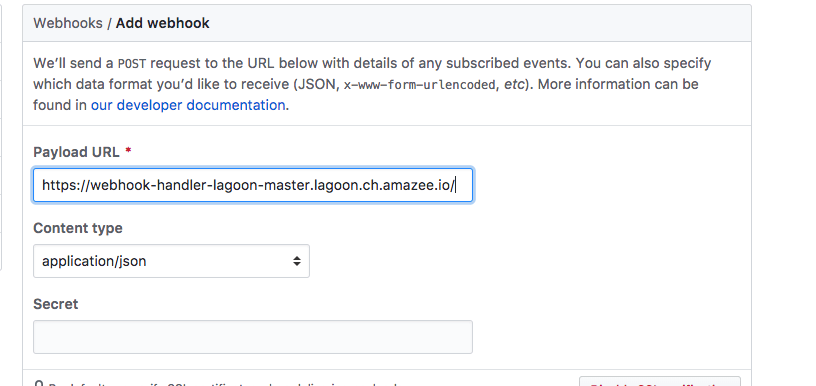
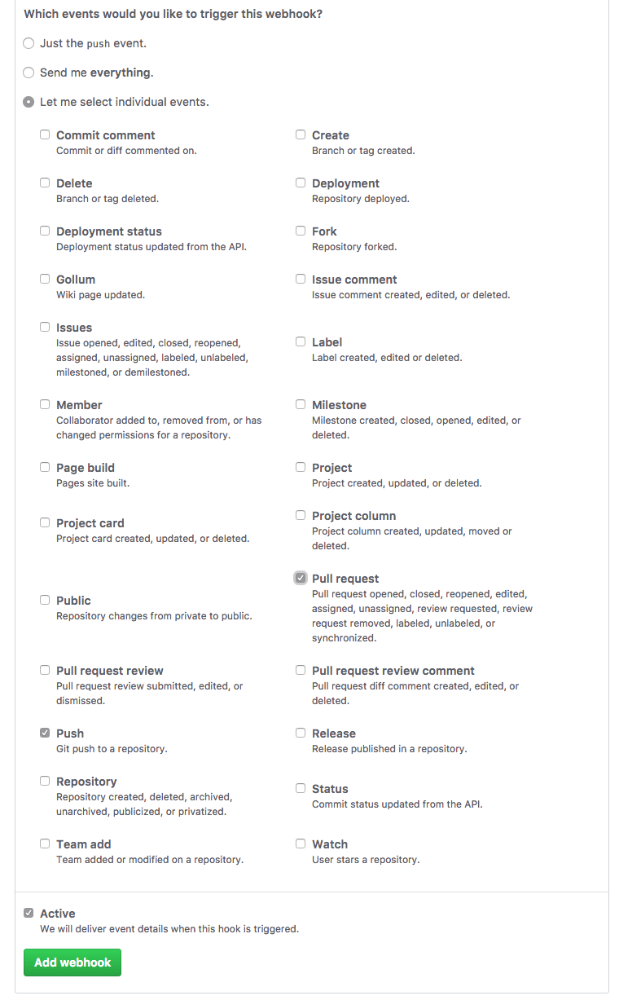
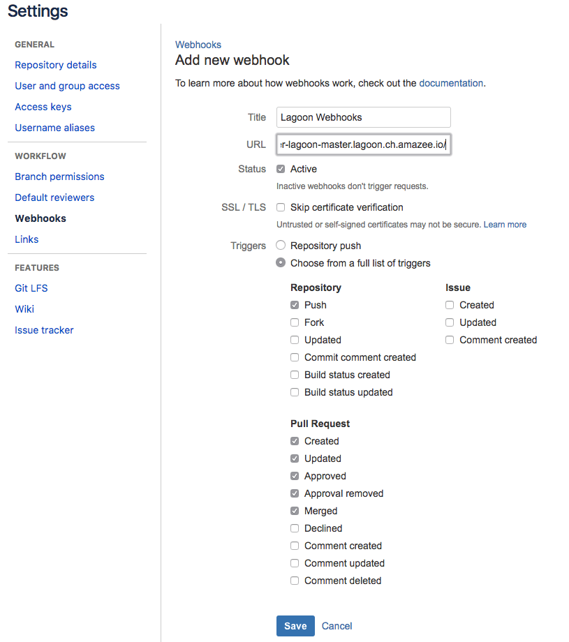

# Configure Webhooks

From your Lagoon administrator, you will also need the route to the webhook-handler. You will add this to your repository as an outgoing webhook, and choose which events to send to Lagoon. Typically you will send all push and pull request  merge request events. In Lagoon it is possible to add a regular expression to determine which branches and pull requests actually result in a deploy.


If you are an amazee.io customer, the route to the webhook-handler is: [`https://hooks.lagoon.amazeeio.cloud`](https://hooks.lagoon.amazeeio.cloud).


## GitHub

* Proceed to Settings -&gt; Webhooks -&gt; `Add webhook` in your repository.
* The `Payload URL` is the route to the webhook-handler of your Lagoon instance.
* Set `Content type` to `application/json`.

* Choose which events will trigger your webhook. It is our suggestion that you send `push` and `Pull request` events, and then filter further in the Lagoon configuration of your project.

* `Add webhook`.

## GitLab

* Navigate to Settings -&gt; Integrations for your repository.
* The `URL` is the route to the webhook-handler of your Lagoon instance.
* Set the `Trigger` for which events will send a notification to Lagoon. It is our suggestion that you send `Push events` and `Merge request events` events, and then filter further in the Lagoon configuration of your project.

* `Add webhook`.

## Bitbucket

* Navigate to Settings -&gt; Webhooks -&gt; Add new webhook in your repository.
* `Title` is for your reference, `URL` is the route to the webhook-handler of your Lagoon instance.
* `Choose from a full list of triggers` and select the following:
  * Repository
    * push
  * Pull request
    * Created
    * Updated
    * Approved
    * Approval Removed
    * Merged
    * Declined

* `Save`.

