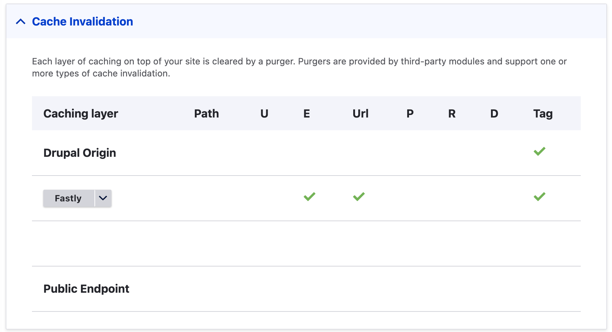

# Integrate Drupal & Fastly

## Prerequisites

* Drupal 7+
* A Fastly service ID
* A Fastly API token with the permission to purge

## Drupal 7 with URL based purging

1. Download and install the [Fastly Drupal module](https://www.drupal.org/project/fastly).
2. Configure the Fastly service ID and API token.
3. Optionally configure the webhooks (so you can ping Slack for instance when a cache purge is sent)
4. Only URL based purging can be done in Drupal 7 (simple purging).
5. Alter Drupal's client IP in `settings.php`:

```php title="settings.php changes for Drupal 7"
$conf['reverse_proxy_header'] = 'HTTP_TRUE_CLIENT_IP';
```

## Drupal 10+ with cache tag purging

Use Composer to get the latest version of the module:

```bash title="Download the Fastly Drupal module and dependencies"
composer require drupal/fastly drupal/http_cache_control drupal/purge
```

You will need to enable the following modules:

* `fastly`
* `fastlypurger`
* `http_cache_control` (2.x)
* `purge`
* `purge_ui` (technically optional, but this is really handy to have enabled on production)
* `purge_processor_lateruntime`
* `purge_processor_cron`
* `purge_queuer_coretags`
* `purge_drush` (useful for purge via Drush, here is a [list of commands](https://git.drupalcode.org/project/purge/-/blob/8.x-3.x/README.md#drush-commands))

### Configure the Fastly module in Drupal

Configure the Fastly service ID and API token. A Site ID is generated for you automatically. You can use runtime environment variables, or you can edit the settings form found at `/admin/config/services/fastly`:

* `FASTLY_API_TOKEN`
* `FASTLY_API_SERVICE`

#### Set the purge options

* Cache tag hash length: 4
* Purge method: Use soft purge

A `4` character cache tag is plenty for most sites, a `5` character cache tag is likely better for sites with _millions_ of entities (to reduce cache tag collisions).

!!! Note
    Soft purging should be used, this means the object in Fastly is marked as stale, rather than being evicted entirely so that it can be used in the event the origin is down (with the feature [serve while stale](https://developer.fastly.com/solutions/tutorials/stale/)).


#### Set the Stale Content Options

Set the options to what makes sense for your site. Minimum 1 hour (`3600`), maximum 1 week (`604800`). Generally something like the following will be fine:

1. Stale while revalidate - on, `14440` seconds
2. Stale if error - on, `604800` seconds


Optionally configure the webhooks (so you can ping Slack for instance when a cache purge is sent).


### Configure the Purge module

Visit the purge page `/admin/config/development/performance/purge`

Set up the following options:

#### Cache Invalidation

* Drupal Origin: Tag
* Fastly: E, Tag, URL



#### Queue

* Queuers: Core tags queuer, Purge block(s)
* Queue: Database
* Processors: Core processor, Late runtime processor, Purge block(s)


What this means is that we will be using Drupal's built-in core tag queuer (add tags to the queue), the queue will be stored in the database (default), and the queue will be processed by

* Cron processor
* Late runtime processor

In order for the cron processor to run, you need to ensure that cron is running on your site. Ideally every minute. You can manually run it in your `cli` pod, to ensure that `purge_processor_cron_cron()` is being executed without errors.

```bash title="start cron"
[drupal8]production@cli-drupal:/app$ drush cron -v
...
[notice] Starting execution of purge_processor_cron_cron(), execution of node_cron() took 21.16ms.
```

The `Late runtime processor` will run in `hook_exit()` for every page load, this can be useful to process the purges nearly as quickly as they come into the queue.

By having both, you guarantee that purges happen as soon as possible.

### Optimal Cache Header Setup

Out of the box, Drupal does not have the power to set different cache lifetimes in the browser vs in Fastly. So if you do set long cache lifetimes in Drupal, often end users will not see them if their browser has cached the page. If you install the `2.x` version of the [HTTP Cache Control](https://www.drupal.org/project/http_cache_control) module, this will give you a lot more flexibility on what caches and for how long.

For most sites, a sensible default could be

* Shared cache maximum age : 1 month
* Browser cache maximum age : 10 minutes
* 404 cache maximum age: 15 minutes
* 302 cache maximum age: 1 hour
* 301 cache maximum age: 1 hour
* 5xx cache maximum age: no cache

!!! Note
    This relies on your site having accurate cache tags represented for all the content that exists on the page.

### True client IPs

We configure Fastly to send the actual client IP back on the HTTP header `True-Client-IP`, you can make Drupal respect this header with the following changes in `settings.php`:

```php title="settings.php changes for Drupal < 8.7.0"
$settings['reverse_proxy'] = TRUE;
$settings['reverse_proxy_header'] = 'HTTP_TRUE_CLIENT_IP';
```

However, with Drupal 8.7.0, [there was a change to remove this functionality](https://www.drupal.org/node/3030558). You can achieve the same goal with the following snippet

```php title="settings.php changes for Drupal >= 8.7.0"
/**
 * Tell Drupal to use the True-Client-IP HTTP header.
 */
if (isset($_SERVER['HTTP_TRUE_CLIENT_IP'])) {
  $_SERVER['REMOTE_ADDR'] = $_SERVER['HTTP_TRUE_CLIENT_IP'];
}
```

### Drush integration

```php title="settings.php"
 fastly:
   fastly:purge:all (fpall)                                                    Purge whole service.
   fastly:purge:key (fpkey)                                                    Purge cache by key.
   fastly:purge:url (fpurl)                                                    Purge cache by Url.
```

## Viewing Fastly caching headers using cURL

Use this function: (works in Linux and Mac OSX)

```bash title="cURL function"
function curlf() { curl -sLIXGET -H 'Fastly-Debug:1' "$@" | grep -iE 'X-Cache|Cache-Control|Set-Cookie|X-Varnish|X-Hits|Vary|Fastly-Debug|X-Served|surrogate-control|surrogate-key' }
```

```bash title="Using cURL"
$ curlf https://www.example-site-fastly.com
cache-control: max-age=601, public, s-maxage=2764800
surrogate-control: max-age=2764800, public, stale-while-revalidate=3600, stale-if-error=3600
fastly-debug-path: (D cache-wlg10427-WLG 1612906144) (F cache-wlg10426-WLG 1612906141) (D cache-fra19179-FRA 1612906141) (F cache-fra19122-FRA 1612906141)
fastly-debug-ttl: (H cache-wlg10427-WLG - - 3) (M cache-fra19179-FRA - - 0)
fastly-debug-digest: 1118d9fefc8a514ca49d49cb6ece04649e1acf1663398212650bb462ba84c381
x-served-by: cache-fra19179-FRA, cache-wlg10427-WLG
x-cache: MISS, HIT
x-cache-hits: 0, 1
vary: Cookie, Accept-Encoding
```

From the above headers we can see that:

* The HTML page is cacheable
* Browsers will cache the page for 601 seconds
* Fastly will cache the page for 32 days (`2764800` seconds)
* Tiered caching is in effect (edge PoP in Wellington, and shield PoP in France)
* The HTML page was a cache hit at the edge PoP

### Sending manual purge requests to Fastly

If you ever want to remove a specific page from cache manually, there are ways to do this.

```bash title="Purge Fastly by single URL"
curl -Ssi -XPURGE -H 'Fastly-Soft-Purge:1' -H "Fastly-Key:$FASTLY_API_TOKEN" https://www.example.com/subpage
```

You can also purge by cache tag:

```bash title="Purge Fastly by cache tag"
curl -XPOST -H 'Fastly-Soft-Purge:1' -H "Fastly-Key:$FASTLY_API_TOKEN" https://api.fastly.com/service/$FASTLY_API_SERVICE/purge/<surrogatekey>
```

You can also use the [Fastly CLI](https://github.com/fastly/cli) which helps to make this a little nicer.
