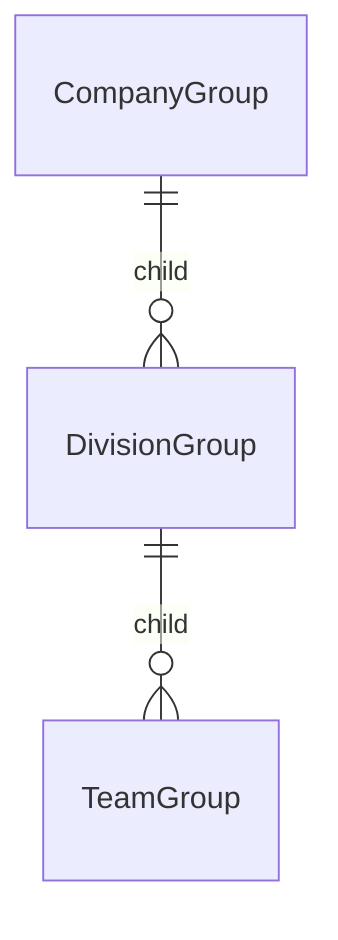

# Groups

_Groups_ are made up of users who have roles.
An organization can have one or more groups.
Each project can be assigned one or more groups.
Groups can be assigned to multiple projects.
Groups are created independently of projects, and then assigned to them.

Organizations have a quota to limit the number of groups assigned to it.
If you need to change the quota, please contact {{ defaults.helpstring }}.

# Subgroups

!!! danger
    Subgroups are not commonly used in Lagoon.
    Unless you are a Lagoon developer, and know exactly what you are doing, you shouldn't use them.

    There is also no guarantee that subgroups will be something Lagoon supports in future, since their complexity is out of proportion to the functionality they provide.

!!! note
    Subgroups are not exposed by the Lagoon UI or Lagoon CLI, but can be created through the Lagoon GraphQL API.

Groups can be nested to an arbitrary depth.
Subgroups are groups which are a child of another group.

A user's role in an ancestor group is inherited by descendant groups.

## Subgroup permission inheritance example

Consider this group structure:

If a User has `maintainer` role in the top level `CompanyGroup`, then they will also have `maintainer` level access to projects which are in the `TeamGroup`.

Note that this relationship is indirect: the Project is not in the same group as the User, but because the Project is in a _subgroup_ of the User's group, the User has `maintainer` permissions on the Project.
