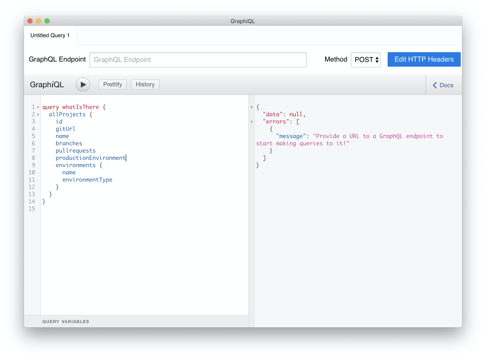

# GraphQL

## GraphQL APIへの接続

LagoonでのAPIとのやりとりはGraphQLを通じて行います。APIに認証するためには、JWT（JSON Web Token）が必要で、これによりSSH公開鍵を通じてAPIに対する認証が行われます。

このトークンを生成するには、`token`コマンドを使ってリモートシェルを使用します：

```bash title="トークンの取得"
ssh -p [PORT] -t lagoon@[HOST] token
```

amazee.ioの例：

```bash title="amazee.ioトークンの取得"
ssh -p 32222 -t lagoon@ssh.lagoon.amazeeio.cloud token
```

これにより長い文字列が返されます。これがJWTトークンです。

また、APIエンドポイントのURLも必要です。これについてはLagoonの管理者に尋ねてください。
<!-- markdown-link-check-disable-next-line -->
amazee.ioではこれは[`https://api.lagoon.amazeeio.cloud/graphql`](https://api.lagoon.amazeeio.cloud/graphql)です。

さて、GraphQLクライアントが必要です！技術的にはこれは単なるHTTPですが、我々はGraphiQLを推奨します。これは素敵なUIを備えており、オートコンプリートでGraphQLのリクエストを書くことができます。ダウンロードしてインストールし、起動します。 \[[GraphiQL App](https://github.com/skevy/graphiql-app)\]

APIエンドポイントURLを入力します。次に"Edit HTTP Headers"をクリックし、新しいヘッダーを追加します：

* "Header name": `Authorization`
* "Header value": `Bearer [jwt token]` \( JWTトークンにスペースがないことを確認してください、それは動作しません\)


HTTPヘッダーオーバーレイを閉じます（ESCキーを押します）。これであなたは初めてのGraphQLリクエストを行う準備が整いました！

左側のウィンドウに次の内容を入力します：

```graphql title="すべてのプロジェクトを取得する"
query whatIsThere {
  allProjects {
    id
    gitUrl
    name
    branches
    pullrequests
    productionEnvironment
    environments {
      name
      environmentType
    }
  }
}
```

そして、▶️ボタンを押すか（またはCTRL+ENTERを押す）。



すべてうまくいけば、初めてのGraphQLレスポンスを見ることができるはずです。

## ミューテーション

LagoonのGraphQL APIは、オブジェクトを表示し、オブジェクトを作成するだけでなく、既存のオブジェクトを更新する機能も持っています。LagoonのすべてのGraphQLはベストプラクティスを使用しています。

!!! 情報

    GraphQLのミューテーションクエリは、データストアのデータを変更し、値を返します。これらは、データの挿入、更新、削除に使用できます。ミューテーションはスキーマの一部として定義されています。

プロジェクト内でデプロイするブランチを更新します：

```graphql title="デプロイブランチを更新"
mutation editProjectBranches {
  updateProject(input:{id:109, patch:{branches:"^(prod|stage|dev|update)$"}}) {
    id
  }
}
```

プロジェクト内の製品環境を更新します：

!!! 警告
    すべての変更がコンテナに反映されるように、再デプロイが必要です。

```graphql title="製品環境の更新"
mutation editProjectProductionEnvironment {
  updateProject(input:{id:109, patch:{productionEnvironment:"prod"}}) {
    id
  }
}
```

また、複数の変更を一つのクエリにまとめることもできます：

```graphql title="複数の変更"
mutation editProjectProductionEnvironmentAndBranches {
  updateProject(input:{id:109, patch:{productionEnvironment:"prod", branches:"^(prod|stage|dev|update)$"}}) {
    id
  }
}
```
