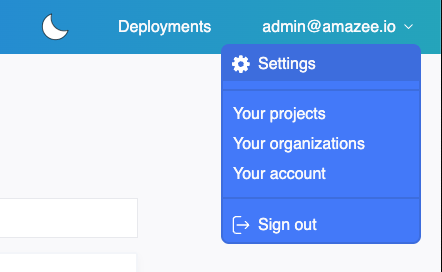

# SSH

Lagoonでは、SSHを通じて実行中のコンテナに接続することができます。コンテナ自体にはSSHサーバーはインストールされていませんが、代わりにSSHを使ってLagoonに接続し、そこからKubernetes APIを通じてリモートシェル接続を作成します。

## SSHアクセスの設定を確認する

### SSHキーの生成

同じキーを複数のコンピューター間で共有するのではなく、各デバイスごとに別々のSSHキーを生成することをお勧めします。各システムでのSSHキーの生成方法については以下を参照してください。

#### OSX(Mac)

[Mac](https://www.makeuseof.com/ssh-keygen-mac){ .md-button }

#### Linux(Ubuntu)

[Linux](https://help.ubuntu.com/community/SSH/OpenSSH/Keys){ .md-button }

#### Windows

[Windows](https://docs.microsoft.com/en-us/windows-server/administration/openssh/openssh_keymanagement){ .md-button }

### SSHエージェント

#### OSX(Mac)

OSXは、起動時に設定されたSSHキーをロードするようにSSHエージェントが設定されていません。これにより問題が発生することがあります。この機能の設定方法については、こちらのガイドを参照してください:[https://www.backarapper.com/add-ssh-keys-to-ssh-agent-on-startup-in-macos/](https://www.backarapper.com/add-ssh-keys-to-ssh-agent-on -startup-in-macos/)

#### Linux

Linuxディストリビューションは、`ssh-agent`の使用方法によります。一般的なガイドはここにあります:[https://www.ssh.com/academy/ssh/agent](https://www.ssh.com/academy/ssh/agent)

#### Windows

最近ではWindowsでのSSHキーのサポートが大幅に向上し、現在ではネイティブにサポートされています。Windows 10のSSHエージェントの設定についての便利なガイドはここにあります:[https://richardballard.co.uk/ssh-keys-on-windows-10/](https://richardballard.co.uk/ssh-keys-on-windows-10/)

### SSHキーのアップロード

### UIを通じて

SSHキーをUIを通じてアップロードできます。通常通りにログインしてください。

右上の角にある設定をクリックします:



次に、SSHキーをアップロードできるページが表示され、アップロードされたキーが表示されます。キーをテキストボックスに貼り付け、名前を付けて「追加」をクリックします。それだけです！必要に応じて追加のキーを追加します。


### コマンドライン経由

ユーザーにSSHキーを追加するためのLagoon APIをGraphQL経由で使用する一般的な例は、[こちら](../interacting/graphql-queries.md#allowing-access-to-the-project)にあります。

## ポッドへのSSH接続

### 接続

接続は直接的で、次のパターンに従います:

```bash title="SSH"
ssh -p [PORT] -t [PROJECT-ENVIRONMENT-NAME]@[HOST]
```

* `PORT` - リモートシェルのSSHエンドポイントポート(amazee.ioの場合:`{{ defaults.sshport }}`)。
* `HOST` - リモートシェルのSSHエンドポイントホスト(amazee.ioの場合`{{ defaults.sshhostname }}`)。
* `PROJECT-ENVIRONMENT-NAME` - 接続したい環境。これは通常`PROJECTNAME-ENVIRONMENT`のパターンで使用されます。

例えば:

```bash title="SSH example"
ssh -p {{ defaults.sshport }} -t drupal-example-main@{{ defaults.sshhostname }}
```

これにより、`main`環境のプロジェクト`drupal-example`に接続します。

### ポッド/サービス、コンテナ定義

デフォルトでは、リモートシェルはタイプ`cli`で定義されたコンテナに接続しようとします。他のポッド/サービスに接続したい場合は、以下のように定義できます:

```bash title="SSH to another service"
ssh -p [PORT] -t [プロジェクト-環境名]@[ホスト] service=[サービス名]
```

あなたのポッド/サービスに複数のコンテナが含まれている場合、Lagoonはあなたを最初に定義されたコンテナに接続します。また、接続したい特定のコンテナを定義することもできます:

```bash title="コンテナを定義します。"
ssh -p [ポート] -t [プロジェクト-環境名]@[ホスト] service=[サービス名] container=[コンテナ名]
```

例えば、`nginx`ポッド内の`php`コンテナに接続するには:

```bash title="SSH to php container"
ssh -p {{ defaults.sshport }} -t drupal-example-main@s{{ defaults.sshhostname }} service=nginx container=php
```

## ファイルのコピー

一般的なケースで、ファイルを`cli`ポッドにコピーすることは、通常のSSH互換ツールを使って達成できます。

### scp

```bash title="Copy file with scp"
scp -o UserKnownHostsFile=/dev/null -o StrictHostKeyChecking=no -P {{ defaults.sshport }} [ローカルパス] [プロジェクト名]-[環境名]@{{ defaults.sshhostname }}:[リモートパス]
```

### rsync

```bash title="Copy files with rsync"
rsync --rsh='ssh -o UserKnownHostsFile=/dev/null -o StrictHostKeyChecking=no -p {{ defaults.sshport }}' [ローカルパス] [プロジェクト名]-[環境名]@{{ defaults.sshhostname }}:[リモートパス]
```

### tar

```bash
ssh -o UserKnownHostsFile=/dev/null -o StrictHostKeyChecking=no -P {{ defaults.sshport }} [プロジェクト名]-[環境名]@{{ defaults.sshhostname }} tar -zcf - [リモートパス] | tar -zxf - -C /tmp/
```

### 非CLIポッド/サービスの指定

まれなケースで、非CLIサービスを指定する必要がある場合は、指定することができます。 `service=...`および/または`container=...`引数はコピーコマンドにあります。

`tar`を`ssh`接続を通してパイプすることは最も単純な方法で、通常の`tar`フラグを用いてファイルやディレクトリーをコピーするために使用できます:

```bash
ssh -o UserKnownHostsFile=/dev/null -o StrictHostKeyChecking=no -P 32222 [プロジェクト名]-[環境名]@{{ defaults.sshhostname }} service=solr tar -zcf - [リモートパス] | tar -zxf - -C /tmp/
```

また、LagoonのSSHサービスに必要な形で`ssh`の引数を並べ替えるラッパースクリプトを用いて`rsync`を使用することもできます:

```bash
#!/usr/bin/env sh
svc=$1 user=$3 host=$4
shift 4
exec ssh -o UserKnownHostsFile=/dev/null -o StrictHostKeyChecking=no -p {{ defaults.sshport }} -l "$user" "$host" "$svc" "$@"
```

それを実行可能なシェルスクリプト`rsh.sh`に入れて、`rsync`コマンドで`service=...`を指定します:

```bash title="rsync to non-CLI pod"
rsync --rsh="/path/to/rsh.sh service=cli" /tmp/foo [プロジェクト名]-[環境名]@{{ defaults.sshhostname }}:/tmp/foo
```

このスクリプトは、`container=...`引数も処理するように調整することもできます。
