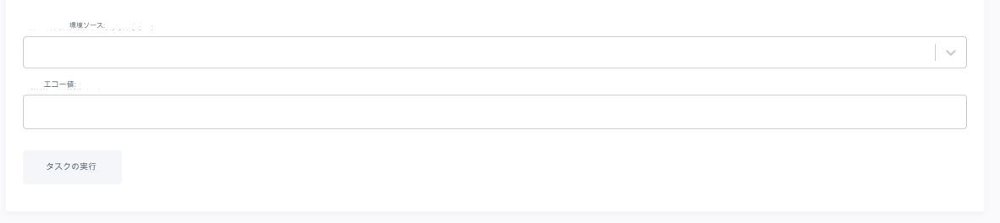

# カスタムタスク

Lagoonでは、環境、プロジェクト、グループレベルでカスタムタスクを定義することができます。現在、これはGraphQL APIを通じて行われ、UIで公開されています。

## カスタムタスクの定義

タスクを定義する際には、いくつかのことを決定する必要があります。

### どのタスクを実行しますか？

ほとんどの場合、実行するカスタムタスクは、アプリケーションのコンテナの一つでシェルから実行されるものです。

例えば、Node.jsアプリケーションでは、`node`コンテナで`yarn audit`を実行することに興味があるかもしれません。この場合コマンドは単純に`yarn audit`となります。

### このタスクはどこで実行されますか？

このタスクがどこで実行されるかを定義する必要があります。これは二つのことを意味します。まず、どのプロジェクトまたは環境でタスクを実行するか、そしてどのサービスで行うかです。

たとえば、`yarn audit`タスクを特定のプロジェクト(この例ではプロジェクトのIDを42としましょう)の任意の環境で実行可能にしたいと考えているとしましょう。タスク定義を作成する際には、下記で説明するように、プロジェクトのIDを指定します。

2つ目の質問は、どの環境をタスクの対象とするかということです。プロジェクトを設定する際に[`docker-compose.yml`](../concepts-basics/docker-compose-yml.md)でいくつかのサービスを指定します。このサービス名を使用してコマンドが実際にどこで実行されるかを決定します。

### このタスクを実行できるのは誰ですか？

タスクシステムへのアクセス権はプロジェクトロールに対応した3つのレベルがあります。ゲスト、デベロッパー、メンテナーです。最も制限的なものから最も制限の少ないものまで、各ロールはそれより下のロールで定義されたタスクを呼び出すことができます(デベロッパーはゲストのタスクを見ることができ、メンテナーはすべてのタスクを見ることができます)。

## タスクの定義

タスクは`addAdvancedTaskDefinition`ミューテーションを呼び出すことで定義されます。重要なことは、これは単にタスクを定義するだけで呼び出すわけではありません。単にそれを環境で実行可能にするだけです。

概念的には呼び出しは次のようになります。

```graphql title="新しいタスクを定義する"
mutation addAdvancedTask {
    addAdvancedTaskDefinition(input:{
    name: string,
    confirmationText: string,
    type: [COMMAND|IMAGE],
    [project|environment]: int,
    description: string,
    service: string,
    command: string,
    advancedTaskDefinitionArguments: [
      {
        name: "ENVIROMENT_VARIABLE_NAME",
        displayName: "Friendly Name For "Variable",
        type: [文字列 | 環境ソース名 | 自己を除く環境ソース名]
      }
    ]
  }) {
    ... on AdvancedTaskDefinitionImage {
      id
      name
      description
      service
      image
      confirmationText
      advancedTaskDefinitionArguments {
        type
        range
        name
        displayName
      }
      ...
    }
    ... on AdvancedTaskDefinitionCommand {
      id
      name
      description
      service
      command
      advancedTaskDefinitionArguments {
        type
        range
        name
        displayName
      }
      ...
    }
  }
}
```

フィールド`name`と`description`は簡単です。これらは主にUIで使用されるタスクの名前と説明です。

`type`フィールドについては説明が必要です。現時点では、プラットフォームの管理者のみが`IMAGE`タイプのコマンドを定義できます。これは、既存のサービスを対象にするのではなく、特定のタスクイメージをタスクとして実行することを可能にします。しかし、ほとんどのタスクは`COMMAND`タイプです。

`[project|environment]`フィールドのセットは、タスクを`project`または`environment`に関連付ける(使用するキーによります)ことで、その値がidになります。 私たちが`yarn audit`のために考えているケースでは、IDが`42`の`project`を対象としていることを明示します。

私たちがタスクでターゲットにしたいサービスを`service`フィールドに置き、`command`は私たちが実行したい実際のコマンドです。

### タスクに渡される引数

Lagoon UI経由でタスクを呼び出すユーザーに柔軟性を与えるために、タスク引数の定義をサポートしています。これらの引数はテキストボックスまたはドロップダウンとして表示され、タスクを呼び出すために必要です。

以下は、2つの引数を設定する方法の例です。

```graphql title="タスク引数の定義"
advancedTaskDefinitionArguments: [
      {
        name: "ENV_VAR_NAME_SOURCE",
        displayName: "Environment source",
        type: ENVIRONMENT_SOURCE_NAME

      },
      {
        name: "ENV_VAR_NAME_STRING",
        displayName: "Echo value",
        type: STRING
        }
    ]
  })
```

このフラグメントは、システムが現在サポートしている両方のタイプの引数を示しています。
最初の`ENV_VAR_NAME_SOURCE`は`ENVIRONMENT_SOURCE_NAME`タイプの例で、UIのユーザーにプロジェクト内の異なる環境のドロップダウンを提示します。タスクが起動した環境で実行されるのを許可したくない場合(例えば、他の環境からデータベースをインポートしたい場合など)は`ENVIRONMENT_SOURCE_NAME_EXCLUDE_SELF`を使用して環境リストを制限することができます。
二つ目の`ENV_VAR_NAME_STRING`は`STRING`型で、ユーザーにテキストボックスを記入するように促します。

ユーザーが選択した値は、タスクが実行されたときに`COMMAND`型のタスクで環境変数として利用可能になります。




### システム全体のタスク

システム全体のタスクを登録できるのはLagoonの管理者のみです。これらのタスクはすべての環境で表示され、ユーザーが持つ権限によって制限されます。

システム全体のタスクを作成する方法は、他のタスクタイプとほぼ同じですが、2つの例外があります。

まず、`addAdvancedTaskDefinition`ミューテーションの中で`systemWide: true`フィールドを設定します。

次に、`groupName`、`project`、`environment`を指定していないことを確認します。これらのフィールドは特定のコンテキストをターゲットにするために使用されるため、指定すると目的を逸脱することになります。


### 確認

`confirmationText`フィールドにテキストがあると、ユーザーがタスクを実行できるようになる前に、UIに確認モーダルが表示されます。 

## タスクの呼び出し

タスクが定義されていると、タスクはLagoon UIのタスクドロップダウンに表示されるはずです。

また、`invokeTask` ミューテーションを使用してGraphQL apiからも呼び出すこともできます。

```graphql title="タスクの呼び出し"
mutation invokeTask {
  invokeRegisteredTask(advancedTaskDefinition: int, environment: int) {
    status
  }
}
```

`invokeTask`は常に特定の環境でタスクを呼び出すことに注意してください。

## 例

では、`yarn audit`の例を設定してみましょう。

```graphql title="タスク定義ミューテーション"
mutation runYarnAudit {
 addAdvancedTaskDefinition(input:{
    name:"Run yarn audit",
    project: 42,
    type:COMMAND,
    permission:DEVELOPER,
    description: "Runs a 'yarn audit'",
    service:"node",
    command: "yarn audit"})
    {
        id
    }
}
```

これにより、私たちのプロジェクト(42)のタスクが定義されます。これを実行すると、タスク定義のIDが返されます(例えば、`9`とします)

このタスクは、`DEVELOPER`または`MAINTAINER`の役割を持つユーザーがUIから実行できるようになります。


