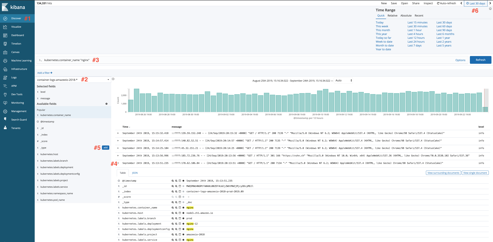

# Kibana Examples

Have you seen [the Kibana getting started video](https://www.elastic.co/webinars/getting-started-kibana) and are now ready to work with logs? We are here to help! This page will give you examples of Kibana queries you can use. This is not a Kibana 101 class, but it can help you understand some of what you can do in Kibana.

Ready to get started? Good!


Make sure that you have selected your tenant before starting! You can do that by on the `Tenant` icon on the left-hand menu. Once you have selected your tenant, click on the `Discover` icon again to get started.


## Router Logs

Below you'll find examples for two common log requests:

* Viewing the total number of hits/requests to your site.
* Viewing the number of hits/requests from a specific IP address. 

### Total Number of hits/requests to your site

* Let's start Kibana up and select `Discovery` \(\#1 in screen shot below\)
* Then the router logs for your project\(\#2\).
* From there, we will filter some of this information down a bit. Let's focus on our main production environment.
* In the search bar \(\#3\), enter:

  `openshift_project: "name of your production project"`

* This will show you all the hits to your production environment in the given time frame.
* You can change the time frame in the upper right hand corner \(\#4\).
* Clicking on the arrow next to the entry \(\#5\) will expand it and show you all the information that was captured.
* You can add any of those fields to the window by hovering over them and clicking add on the left hand side \(\#6\).
* You can also further filter your results by using the search bar.

### Number of hits/requests from a specific IP address

Running the query above will give you a general look at all the traffic to your site, but what if you want to narrow in on a specific IP address? Perhaps you want to see how many times an IP has hit your site and what specific pages they were looking at. This next query should help.

We are going to start off with the same query as above, but we are going to add a couple of things.

* First, add the following fields: `client_ip` and `http_request`.
* This will show you a list of all IP addresses and the page they requested. Here is what we see for the Amazee.io page:

That looks good, but what if we wanted to just show requests from a specific IP address? You can filter for the address by adding it to your search criteria.

* We are going to add: `AND client_ip: "IP address"`.
* That will filter the results to just show you hits from that specific IP address, and the page they were requesting. Here is what it looks like for our Amazee.io website:

## Container Logs

Container logs will show you all `stout` and `sterr` messages for your specific container and project. We are going to show an example for getting logs from a specific container and finding specific error numbers in that container.

### Logs from a container

Want to see the logs for a specific container \(php, nginx, etc\)? This section will help! Let's focus on looking at Nginx logs.

* We start by opening up Kibana and selecting Discover \(\#1 in the screen shot below\).
* From there, we select the container logs for our project \(\#2\).
* Let's go to the search bar \(\#3\) and enter: `kubernetes.container_name: "nginx"`
* This will display all Nginx logs for our project.
* Clicking on the arrow next to an entry \(\#4\) will expand that entry and show you all of the information it gathered.
* Let's add the message field and the level field to the view. You can do that by clicking on "Add" on the left hand side \(\#5\).
* You can change the time frame in the upper right hand corner of the screen \(\#6\), in the example below I'm looking at logs for the last 4 hours.

### Specific errors in logs

Want to see how many 500 Internal Server errors you've had in your Nginx container? You can do that by changing the search query. If you search:

`kubernetes.container_name: "nginx" AND message: "500"`

That will only display 500 error messages in the Nginx container. You can search for any error message in any container that you would like!

## Visualization

Kibana will also give you the option to create visualizations or graphs. We are going to create a chart to show number of hits/requests in a month using the same query we used above.

1. Click on Visualize on the left hand side of Kibana.
2. Click on the blue plus sign.
3. For this example, we are going to select a Vertical Bar chart.
4. Select the router logs for your project.
5. Click on X-Axis under Buckets and select Date Histogram, with the interval set to daily
6. Success!! You should now see a nice bar graph showing your daily traffic.


Make sure that you select an appropriate time frame for the data in the upper right hand corner.


Here is an example of a daily hits visualization chart:

Also note that you can save your visualizations \(and searches\)! That will make it even faster to access them in the future. And because each account has their own Kibana Tenant, no searches or visualizations are shared with another account.

## Troubleshooting



