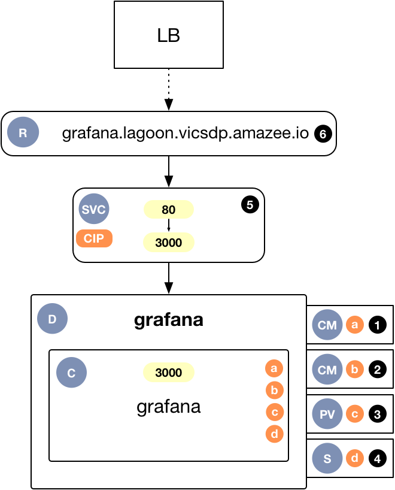
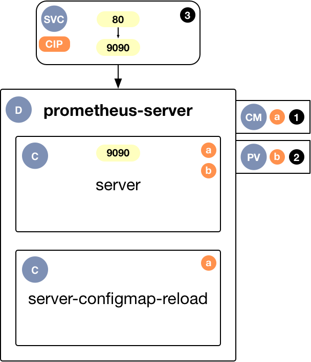
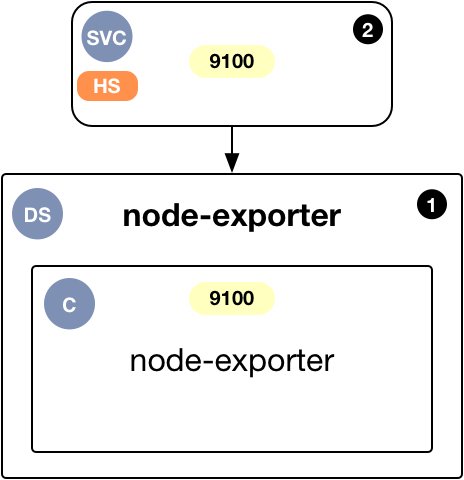
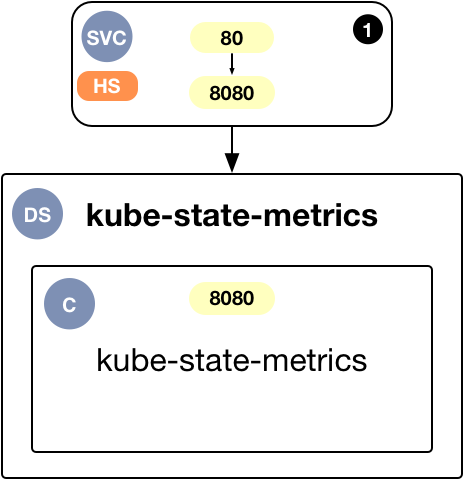

# Metrics Architecture

---

This document provides an architectural overview of the metrics solution.

The metrics solution is comprised of two main parts.  A Grafana deployment for visualising the metrics and a Prometheus deployment with related exporters to collect the metrics.

---

## Grafana

Grafana is defined as a `Deployment`.

1. This `ConfigMap` contains the Grafana configuration, as defined by the Helm Chart.
2. This `ConfigMap` contains the default Grafana dashboards, as defined by the Helm Chart.
3. This `PersistentVolume` contains the read/write data directory for Grafana.  It is used to persist configuration changes and new dashboards.
4. This `Secret` contains the Grafana admin user password.
5. This `Service` is defined as a Cluster IP (CIP).
6. An OpenShift `Route` is used to make Grafana visible externally.

## Prometheus

**Server**

Prometheus Server is defined as a `Deployment`.

1. The `ConfigMap` contains the Prometheus configuration, as defined by the Helm Chart.
  a. The `server-configmap-reload` container watches for changes to the configuration files.
  b. If a change is detected then an API method is called on the `server` container to trigger a configration reload.
2. This `PersistentVolume` contains the collected metrics.
3. There is no `Route` attached to this `Service` as Prometheus does not provide authentication.

**Node Exporter**

Node Exporter is defined as a `DaemonSet`.  It is responsible fofr retrieving metrics from the node it is deployed to.

1. The `node-exporter` `DaemonSet` is configured with a node selector of `region: node`.  This ensures that it only runs on worker nodes.
2. This `Service` is defined as a Headless Service (HS), i.e. a Cluster IP with a definition of `None`.  The `Service` is used by Prometheus to discover the `EndPoints` to scrape from.

**Kube State Metrics**

Kube State Metrics is deployed as a `Deployment`.  It is responsible for retrieving metrics from the Kubernetes API.

1. This `Service` is defined as a Headless Service (HS), i.e. a Cluster IP with a definition of `None`.  The `Service` is used by Prometheus to discover the `EndPoints` to scrape from.