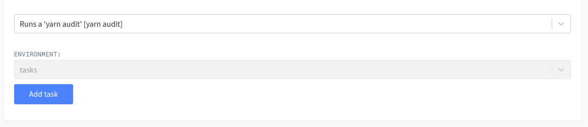

# Custom Tasks

Lagoon allows for the definition of custom tasks at environment, project, and group levels. This is presently accomplished through the GraphQL API and exposed in the UI.

## Defining a custom task

When defining a task you need to determine a number of things.

### Which task do you want to run?

In most cases, the custom task you will be running will be something that will be run in a shell on one of the containers in your application.

For instance, in a NodeJS application, you may be interested in running a `yarn audit` in your `node` container. The command, in this case, would simply be `yarn audit`.

### Where will this task be run?

We have to define where this task will be run -- this means two things, first, which project or environment we'll be running the task in, and, second, which service.

Let's say that we'd like for our `yarn audit` task to be available to run in any environment in a specific project \(let's say the project's ID is 42 for this example\). We will therefore specify the project's id when we create our task definition, as we will describe below.

The second question regards which environment we want to target with our task. When you set up your project, you specify several services in your [docker-compose.yml](../using-lagoon-the-basics/docker-compose-yml.md). We use this service name to determine where the command is actually executed.

### Who can run this task?

There are three levels of permissions to the task system corresponding to project roles. Guest, Developer, and Maintainer -- from most restrictive to least restrictive, with each role being able to invoke the tasks defined for the lower role \(Developer can see Guest tasks, Maintainers can see all tasks\).

## Defining a task

Tasks are defined by calling the "addAdvancedTaskDefinition" mutation. Importantly, this simply _defines_ the task, it does not invoke it. It simply makes it avaliable to be run in an environment.

Schematically, the call looks like this

```text
mutation addAdvancedTask {
    addAdvancedTaskDefinition(input:{
    name: string,
    type: [COMMAND|IMAGE],
    [project|environment]: int,
    description: string,
    service: string,
    command: string
  }) {
    ... on AdvancedTaskDefinitionImage {
      id
      name
      description
      service
      image
      ...
    }
    ... on AdvancedTaskDefinitionCommand {
      id
      name
      description
      service
      command
      ...
    }
  }
}
```

Fields `name` and `description` are straightforward. They're simply the name and description of the task - these are used primarily in the UI.

The `type` field needs some explanation - for now, only platform admins are able to define `IMAGE` type commands - these allow for the running of specifically created task images as tasks, rather than targeting existing services. Most tasks, though, will be `COMMAND` types.

The `[project|environment]` set of fields will attach the task to either the `project` or `environment` \(depending on the key you use\), with the value being the id. In the case we're considering for our `yarn audit` we will specify we're targeting a `project` with an id of `42`.

We put the service we'd like to target with our task in the `service` field, and `command` is the actual command that we'd like to run.

## Invoking the task

With the task now defined, the task should now show up in the tasks dropdown in the Lagoon UI.

We are also able to invoke it via the GraphQL api by using the `invokeTask` mutation.

```text
mutation invokeTask {
  invokeRegisteredTask(advancedTaskDefinition: int, environment: int) {
    status
  }
}
```

Note that `invokeTask` will always invoke a task on a _specific environment_.

## Example

Let's now setup our `yarn audit` example.

```text
mutation runYarnAudit {
 addAdvancedTaskDefinition(input:{
    name:"Run yarn audit",
    project: 42,
    type:COMMAND,
    permission:DEVELOPER,
    description: "Runs a 'yarn audit'",
    service:"node",
    command: "yarn audit"})
    {
        id
    }
}
```

This, then, will define our task for our project \(42\). When we run this, we will get the id of the task definition back \(for argument's sake, let's say it's `9`\)

This task will now be available to run from the UI for anyone with the `DEVELOPER` or `MAINTAINER` role.


