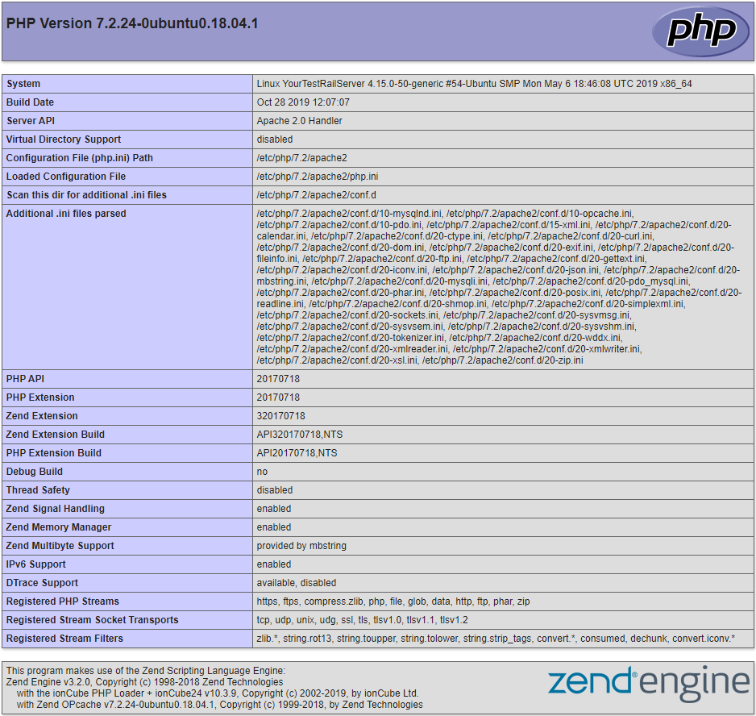

# Setting up Xdebug with Lagoon

!!! Note "Note:"
    Note: some uselagoon base images are still using Xdebug v2, and will be upgraded soon. You can [keep track on this issue](https://github.com/uselagoon/lagoon-images/issues/40).

Xdebug v3 changed the default `remote_port`/`client_port` from 9000 to 9003. If you're using the uselagoon v2 images and generate a fresh debug config in VSCode, it will be Xdebug v3 and your defaults won't match.

## Enable Xdebug Extension

The uselagoon provided Base images are pre-configured to include `Xdebug`. For performance reasons, the extension is not installed by default. To install Xdebug, set the environment variable `XDEBUG_ENABLE` to any string.

1. **Locally** \(pygmy and Lando\)
   1. If you’re using the amazee.io example `docker-compose.yml` file, this setting already exists. Uncomment these lines: [https://github.com/amazeeio/drupal-example-simple/blob/9.x/docker-compose.yml#L16-L17](https://github.com/amazeeio/drupal-example-simple/blob/9.x/docker-compose.yml#L16-L17).
   2. Make sure to rebuild and restart the container after changing this setting.
2. **Remotely** \(dev/prod\)
   1. You can [use the Lagoon API to add the environment variable to a running environment](environment-variables.md#runtime-environment-variables-lagoon-api). Make sure to redeploy the environment after changing this setting.

## Activate xDebug Extension

Even if Xdebug is installed, it may not be enabled. Base images provided by Lagoon are pre-configured to require an activation trigger for the Xdebug extension to start a session. You can [view the complete documentation](https://2.xdebug.org/docs/remote#starting) for starting the debugger but the most straightforward instructions are below.

### CLI

The `php-cli` image is configured to _always_ activate Xdebug when it’s installed, so there is nothing else that needs to be done. Running any PHP script will start a debugging session.

### Web

[Install a browser extension](https://2.xdebug.org/docs/remote#browser-extensions) to set/unset an activation cookie.

Make sure the activation cookie is set for the website you want to start debugging.

## Configure PHPStorm

1. PHPStorm is configured correctly out of the box.
2. Click the “**Start Listening for PHP Debug Connections**” icon in the toolbar.
3. Load a webpage or run a Drush command.
4. On first run, PHPStorm should pop up a window asking you to:
   1. Confirm path mappings.
   2. Select the correct file locally that was triggered on the server.

## Configure Visual Studio Code

1. [Install the PHP Debug extension](https://marketplace.visualstudio.com/items?itemName=felixfbecker.php-debug) by Felix Becker.
2. [Follow the instructions](https://marketplace.visualstudio.com/items?itemName=felixfbecker.php-debug#vs-code-configuration) to create a basic `launch.json` for PHP.
3. Add correct path mappings. For a typical Drupal site, an example would be:

   ```text
   "pathMappings": {
     "/app": "${workspaceFolder}",
   },
   ```

4. In the **Run** tab of Visual Studio Code, click the green arrow next to “**Listen for Xdebug**”
5. Load a webpage or run a Drush command.

## Troubleshooting

* Verify that Xdebug extension is installed. The best way to do this on a Drupal site is to check the PHP status page. You should find a section about Xdebug and all its settings.



* Verify the following settings:

|  |  |
| :--- | :--- |
| `xdebug.remote_enabled` | On |
| `xdebug.remote_host` | `host.docker.internal` or your IP address |
| `xdebug.remote_port` | 9000 |

* Verify you have the activation cookie set. You can use the browser tools in Chrome or Firefox to check that a `XDEBUG_SESSION` cookie is set.
* Verify that Xdebug is activated and attempting to start a debug session with your computer. You can use the `nc -l 9000` command line tool to open the Xdebug port. If everything is configured in PHP correctly, you should get a Xdebug init response when you load a webpage or run a Drush command.
* Verify that the `xdebug.remote_host` has been set correctly. For local debugging with docker for mac, this value should be `host.docker.internal`. For remote debugging this value should be your IP address. If this value was not correctly determined, you can override it by setting the `DOCKERHOST` environment variable.
* Verify that Docker for Mac networking is not broken. On your host machine, run `nc -l 9000`, then in a new terminal window, run:

  ```text
  docker-compose run cli nc -zv host.docker.internal 9000
  ```

* You should see a message like: `host.docker.internal (192.168.65.2:9000) open`.
* When using Lando locally, in order to debug scripts run from the CLI you must first SSH into the cli container via `lando ssh`. You won’t be able to debug things by running `lando drush` or `lando php`.
* You can enable the Xdebug log by setting the `XDEBUG_LOG` environment variable. Logs will be saved to `/tmp/xdebug.log`.
