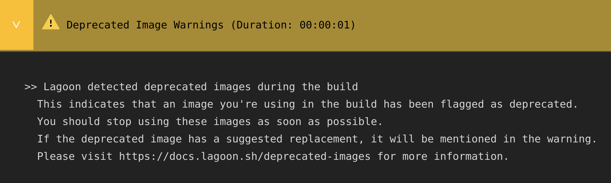

# Lagoon Build Errors and Warnings

Newer releases of Lagoon have the capability to identify potential issues with the build, and highlight them as warnings without failing. This is also a way for the Lagoon team to inform users of pending deprecations and changes to functionality.

For example, if the Lagoon team makes a change to a setting in `lagoon.yml`, and there’s something that users need to change, the warning will mention it, so users will be able to change it before it becomes a breaking change. They should be resolved ASAP wherever possible, as future releases of Lagoon may not be able to handle the errors, but they shouldn't stop your build.

If you aren't sure how to resolve these errors, please reach out to {{ defaults.helpstring }}, or ask a question in the [Lagoon community](../community/discord.md).

## Docker Compose Errors

Please also see the section on [Common Docker Compose Issues](../concepts-basics/docker-compose-yml.md#common-docker-compose-issues), as some of these issues may be covered there

``` shell title="Lagoon Build output indicating env_file error"
> an env_file is defined in your docker-compose file, but no matching file found
```

Docker Compose expects a referenced env file to be present at build time, but that env file is only present in local development, or has been excluded from the Dockerfile. The Lagoon team is working to hopefully allow Docker Compose to ignore this error, so this warning will remain until we have a resolution.

``` shell title="Lagoon Build output indicating string key error"
> an invalid string key was detected in your docker-compose file
```

There is an error in your Docker Compose file, most likely relating to a malformed or misused alias or anchor. The error message should help you understand where.

``` shell title="Lagoon Build output indicating yaml validation error"
> There are yaml validation errors in your docker-compose file that should be corrected
```

There is an error in your Docker Compose file, most likely relating to a malformed or misused alias or anchor. The error message should help you understand where.

## Deprecated Images

Please see the [dedicated page](../docker-images/deprecated-images.md) on how to handle this warning


