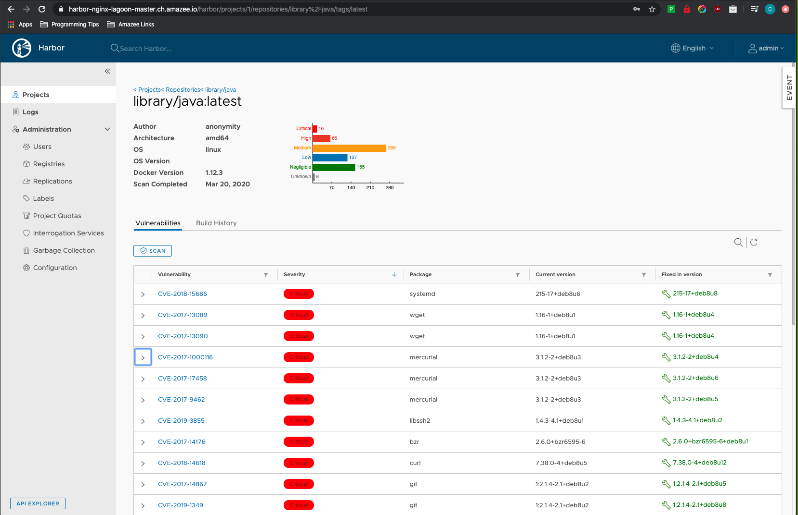

Harbor comes with a built-in security scanning solution provided by the Clair service. This service analyzes a specified container image for any installed packages, and collects the version numbers of those installed packages. The Clair service then searches the [National Vulnerability Database](https://nvd.nist.gov/) for any CVE (common vulnerabilities and exposures) affecting those package versions. These vulnerabilities are then reported within Harbor for each individual container.

An example of a security scan in Harbor, showing applicable vulnerabilites for a scanned container:
